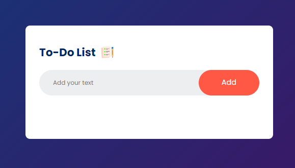

# To-Do List Web Application

This is a simple web-based To-Do List application. You can add, mark, and remove tasks with ease. It's a great way to keep track of your tasks and stay organized.

## Live Demo

[Live Demo](https://sufianadnan.github.io/To-Do-List/)

## Features

- Add tasks to your to-do list.
- Mark tasks as completed.
- Remove tasks from the list.

## Technologies Used

- HTML
- CSS
- JavaScript

## How to Use

1. Clone this repository to your local machine.

```bash
git clone https://github.com/YOUR_USERNAME/todo-list-app.git
```
2. Open the index.html file in your web browser.

3. Start adding tasks to your to-do list!


## Screenshots


